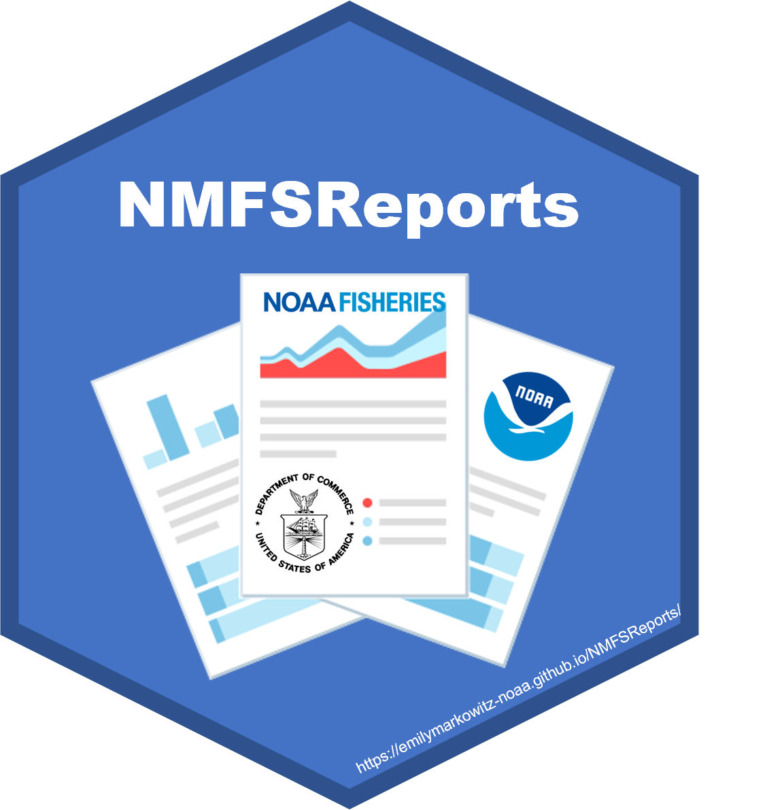

---
output:
  md_document:
    variant: gfm
---

<!-- README.md is generated from README.Rmd. Please edit that file -->

# NMFSReports <a href={https:://nmfs-general-modeling-tools.github.io/nmfspalette}>

### *Easily write NOAA reports and Tech Memos in R Markdown*

[](https://github.com/EmilyMarkowitz-NOAA/NMFSReports)
[](https://lifecycle.r-lib.org/articles/stages.html#maturing)
[](https://github.com/EmilyMarkowitz-NOAA/NMFSReports/commits/main)

## Author

**Emily Markowitz** (Emily.Markowitz AT noaa.gov)

Alaska Fisheries Science Center,

National Marine Fisheries Service,

National Oceanic and Atmospheric Administration,

Seattle, WA 98195

## Installation

#### `NMFSReports`

Learn more about this package at this [pkgdown
webpage!](https://emilymarkowitz-noaa.github.io/NMFSReports/)

The NMFSReports Package has all of the basic architecture you need to
create reproducible and repeatable NOAA Tech Memos in R Markdown! This
approach is perfect for efficiently rolling out annual (or other
regular) reports or reports with formulaic sections (the same chapter
structure but for a different area or species). Scripts integrate table,
figure, data, and bibliography management and design automation.

``` r
library(devtools)
devtools::install_github("EmilyMarkowitz-NOAA/NMFSReports")
library(NMFSReports)

# Or, alternatively, 
remotes::install_github("EmilyMarkowitz-NOAA/NMFSReports@main")
```

#### You may also consider useing this package with `nmfspalette`

A package for NOAA Fisheries color schemes. More info
[here](https://github.com/nmfs-general-modeling-tools/nmfspalette).

``` r
library(devtools)
devtools::install_github("nmfs-general-modeling-tools/nmfspalette")
library(nmfspalette)
```

## Conference Presentations

Markowitz, EH. Reproducible Reports in R Markdown - Perspectives and
{NMFSReports}. R Cascadia Conf., June 2021. Remote.
([Slides](https://github.com/EmilyMarkowitz-NOAA/NMFSReports/blob/main/presentations/2021-06-05NMFSReports-RCascadiaConf.pdf),
[Recording of
Presentation](https://www.youtube.com/watch?v=zNKdQ6jvr-M&list=PLzwtsyfF_Z4pPszfwklTD66AWUuMwS7qw&index=11))

Markowitz, EH. Reproducible National-level Reports: Using RMarkdown to
Recode the Fisheries Economics of the US Report.

-   Women in Statistics and Data Science Conf.; American Statistical
    Association, September 2020. Remote.
-   American Fisheries Society, September 2020. Remote.
-   SatRDay Conference, March 2020. Washington, D.C./Remote.
    ([Recording](https://youtu.be/-mycRwaC60A))

## Abstract

Scientists in government and beyond are often tasked with preparing
analysis-driven reports that inform policy and are crucial for
documenting the state of their programs at regular intervals (e.g.,
annually, quarterly, monthly). Although these reports typically follow
the same format for each iteration, updating content with new data from
previous document line by line can lead to inefficient writing and
introduce errors.

Alternatively, R and R Markdown can be used to systematically modernize
report creation. To address this need within our agency I have developed
a new R package, `{NMFSReports}`, which uses R and R Markdown to provide
an analysis-to-product approach to report writing by centralizing
back-end data analyses and efficiently streamlining copy-edit and design
sub-processes. The `{NMFSReports}` R package first creates the basic
report outline and folder architecture to create reproducible reports,
and then provides users with grammar and organization helper functions
that assist in report writing. To aid in the final publication process,
this workflow can also be used to produce intermediate output files for
subject matter experts and collaborators to review and use.
`{NMFSReports}` can produce copy-edit ready and accessibility-compliant
documents for editors, style guide-formatted and flow-in ready text
(including bibliography, footnote, figure, and table management) for
authors, tables and figures for graphic designers, and web-ready data
files for web tool developers. Though this package is in early stages of
development, it is already clear it has the potential to save colleagues
across our agency countless hours and improve efficiency and consistency
among our teams and offices. Though developed for reports produced by
scientists at NOAA Fisheries, the concepts and structures behind
`{NMFSReports}` have utility for anyone seeking to streamline reports,
graphics, and web tools.

## NOAA README

This repository is a scientific product and is not official
communication of the National Oceanic and Atmospheric Administration, or
the United States Department of Commerce. All NOAA GitHub project code
is provided on an ‘as is’ basis and the user assumes responsibility for
its use. Any claims against the Department of Commerce or Department of
Commerce bureaus stemming from the use of this GitHub project will be
governed by all applicable Federal law. Any reference to specific
commercial products, processes, or services by service mark, trademark,
manufacturer, or otherwise, does not constitute or imply their
endorsement, recommendation or favoring by the Department of Commerce.
The Department of Commerce seal and logo, or the seal and logo of a DOC
bureau, shall not be used in any manner to imply endorsement of any
commercial product or activity by DOC or the United States Government.

## NOAA License

Software code created by U.S. Government employees is not subject to
copyright in the United States (17 U.S.C. §105). The United
States/Department of Commerce reserve all rights to seek and obtain
copyright protection in countries other than the United States for
Software authored in its entirety by the Department of Commerce. To this
end, the Department of Commerce hereby grants to Recipient a
royalty-free, nonexclusive license to use, copy, and create derivative
works of the Software outside of the United States.


[U.S. Department of Commerce](https://www.commerce.gov/) \| [National
Oceanographic and Atmospheric Administration](https://www.noaa.gov) \|
[NOAA Fisheries](https://www.fisheries.noaa.gov/)
