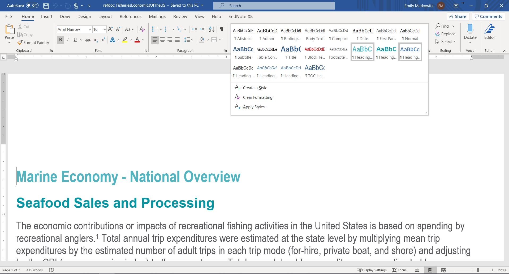

```{r, include = FALSE}
knitr::opts_chunk$set(message = FALSE, echo = TRUE, warning = FALSE, 
  collapse = TRUE,
  comment = "#>"
)

TF<-FALSE
```

# Load Package

```{r setup}
PKG <- c(# devtools::install_github("emilymarkowitz-NOAA/NMFSReports", force = TRUE)
         "NMFSReports",
         
         # Data Managment
         "tidyverse",
         "filesstrings", 
         "data.table", 
         "plyr",  
         "dplyr",
         
         # #RMarkdown
         "rmarkdown",
         "kableExtra"
)


for (p in PKG) {
  if(!require(p,character.only = TRUE)) {  
    install.packages(p, repos = "http://cran.us.r-project.org")
    require(p,character.only = TRUE)}
}
```

# Create initial structure of report

Do everyone here a favor and create a new r project or at least set up a working directory (`setwd()`). There will be a lot of file management here...

To build your intitial architecture for your new NOAA Tech Memo or Report, simply run the below script: 

## sections

Let's first think about what you want/need your Tech Memo to look like. For my purposes, I'll assume that you need the below sections:

```{r}
  # list the sections (that you will have different rmd scripts for) in order and with no spaces
sections <- c("frontmatter", # This is a specific template that matches the NOAA Template
               "abstract", # This, and all others unless otherwise mentioned, come from the same plain-slate document but are appropriately named and linked up in the 'run' file. 
               "introduction", 
               "methods", 
               "results", 
               "discussion", 
               "workscited", 
               "workscitedR") # This is a specific template that will document all of the R packages you used to create this report. I'm biased, but please give credit where credit is due!
```

## support_scripts

And to make sure we nice and neatly compartemantalize our work, I'm going to create the below supporting .R files that I will source into my 'run' file:

```{r}
support_scripts <-
    c(# note a 'run' file is automatically created. Think of this as the spine of your document. 
      "functions", # where I will save all report-specific functions
      "dataDL", # Where we will download the data (e.g., from Oracle or an API). You may only want to run this every so often or regularly, up to you
      "data" # Where I will load that data kept locally that was either downloaded in "dataDL" or created locally
)
```

## wordstylesreference.docx

`wordstylesreference.docx` is a document style reference guide is essentially a word document where you have defined each style. Either use a local document (insert "path") or some of the pre-made templates ("refdoc_NOAATechMemo" or "refdoc_FisheriesEconomicsOfTheUS"). Default = "NOAATechMemo"

```{r}
wordstylesreference.docx = "NOAATechMemo"
```

Here's what they look like: 

# ### NOAATechMemo
# 
# 
# 
# ### FisheriesEconomicsOfTheUS
# 
# 


## csl

`csl` is a citation style. Either use a local document (insert "path") or some of the pre-made templates ("apa"). Default = "apa" because it was easy to find. 

```{r}
csl = "apa"

# it looks something like this:
apa <- base::readLines(system.file("cit","apa.csl", package="NMFSReports"))
head(apa)
```

# Create Report Outline

Now, magic! Now for the sake of the vignette, I can't actually run it here, but below is a picture of what this looks like:

```{r}
# NMFSReports::buildTM(
#   sections, 
#   support_scripts, 
#   wordstylesreference.docx,
#   csl
#   ) 
```


